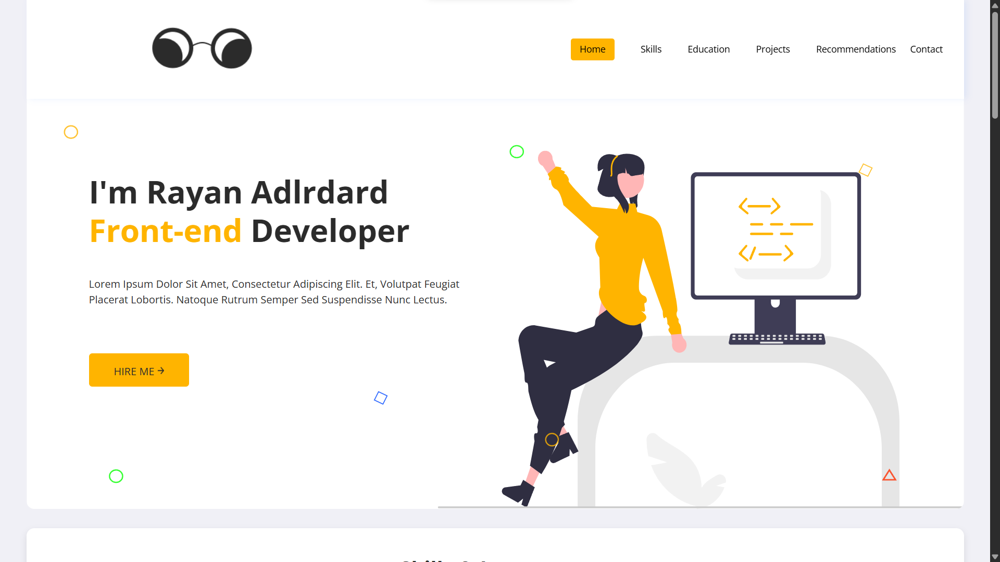
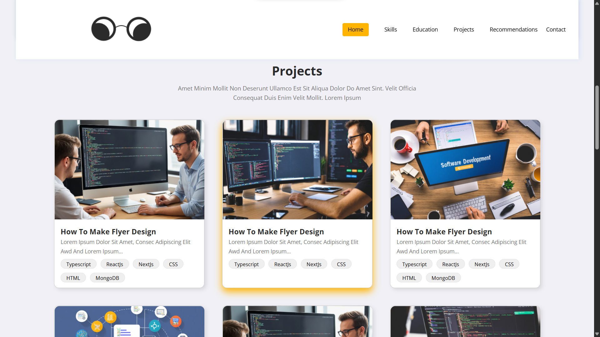
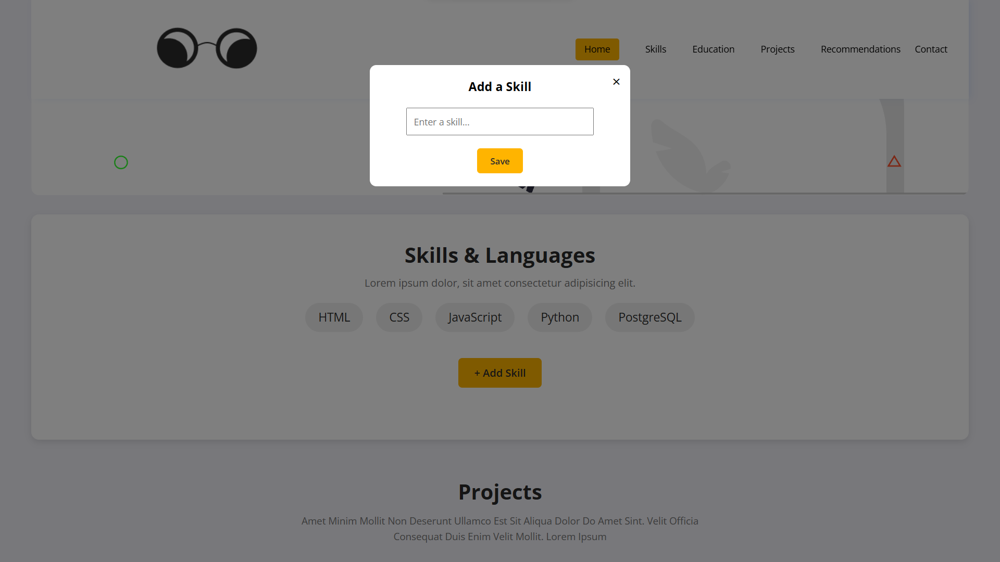
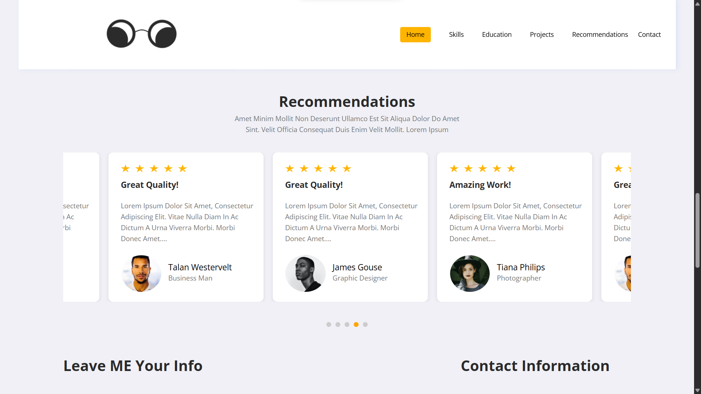
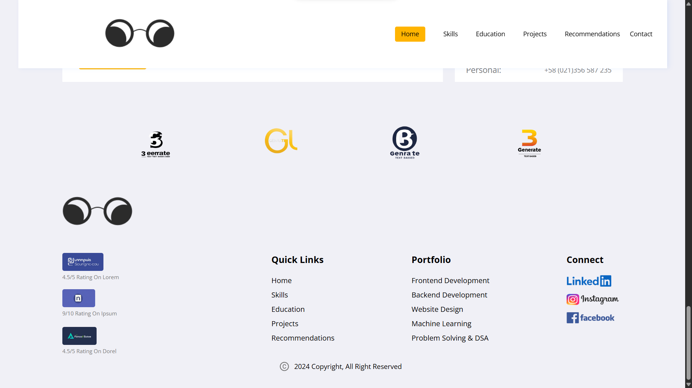

# 💼 Portfolio Website - Josh Technology Internship Task

This is a **personal portfolio website** built as part of the frontend assignment for the internship recruitment process at **Josh Technology**. The project was developed using only **HTML**, **CSS**, and **JavaScript**, as per the assessment requirements.

This project showcases my ability to design and build a fully functional and responsive frontend using core web technologies without relying on external libraries or frameworks.


---

## 🖼️ Screenshots

### 🔝 Hero Section & Header


### 📁 Projects Section


### 🧠 Skills Section


### 💬 Recommendations Section


### 📞 Footer Section



---


## 🔧 Technologies Used

- **HTML5**  
- **CSS3** 
- **JavaScript (Vanilla)**  

---

## 🛠️ Setup Instructions

1. **Clone the repository:**
   ```bash
   git clone https://github.com/ShivamGupta-16/joshtech-internship-portfolio.git
   ```

2. **Navigate to the project folder:**
   ```bash
   cd portfolio-joshtech
   ```

3. **Open the index.html file in your browser:**
   ```bash
   start index.html  # For Windows
   ```

   Or simply double-click the `index.html` file.

---

## 📂 Folder Structure

```
portfolio-joshtech/
│
├── index.html          # Main HTML file
├── style.css           # Styling file
├── script.js           # JavaScript file
├── images/             # Images and other media
├── screenshots/        # screenshot of the project (website)
└── README.md           # This file
```

---


## 📢 Disclaimer

This project was submitted as part of an internship assessment for **Josh Technology** and does not represent any official affiliation with the company.

---

## ⭐️ If you like this project...

Feel free to **star** this repository and share feedback!  
Contributions or suggestions are always welcome.
